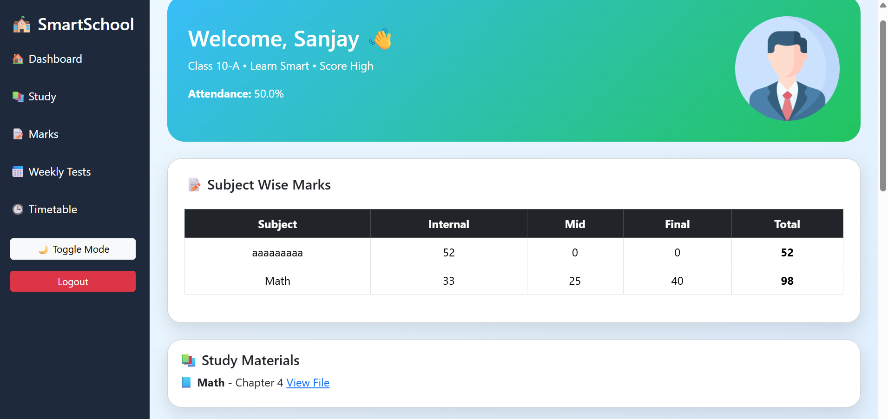
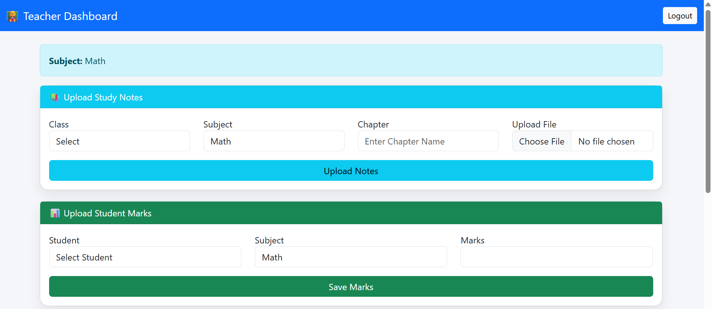
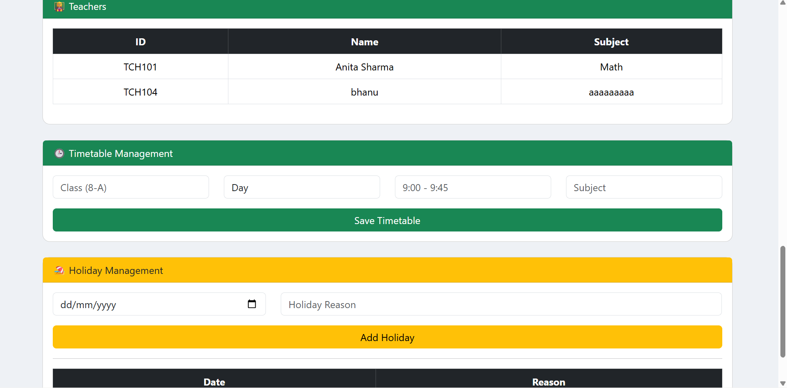

# 🎓 SmartSchool Management System

A complete role-based School Management System built using Flask and MySQL.

---

## 🚀 Features

- 🔐 Secure Login System
- 👨‍🎓 Student Dashboard
- 👩‍🏫 Teacher Dashboard
- 👨‍👩‍👧 Parent Dashboard
- 👨‍💼 Principal Dashboard
- 📊 Marks Management
- 🧾 Attendance Tracking
- 📢 Announcements
- 📚 Study Materials Upload
- 🏖 Holiday Management
- 🕒 Timetable Management

---

## 🛠 Tech Stack

- Python (Flask)
- MySQL
- HTML5
- Bootstrap 5
- Git & GitHub

---

## 📸 Screenshots

### 🔐 Login Page

### 👨‍🎓 Student Dashboard

### 👩‍🏫 Teacher Dashboard

### 👨‍👩‍👧 Parent Dashboard

### 👨‍💼 Principal Dashboard

---

## ⚙️ Setup Instructions

1. Clone the repository
2. Create `.env` file with DB credentials
3. Run database.sql
4. Install dependencies
5. Run `python app.py`

---

## 👨‍💻 Developed By

Sai Pavan
